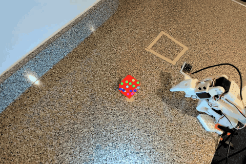
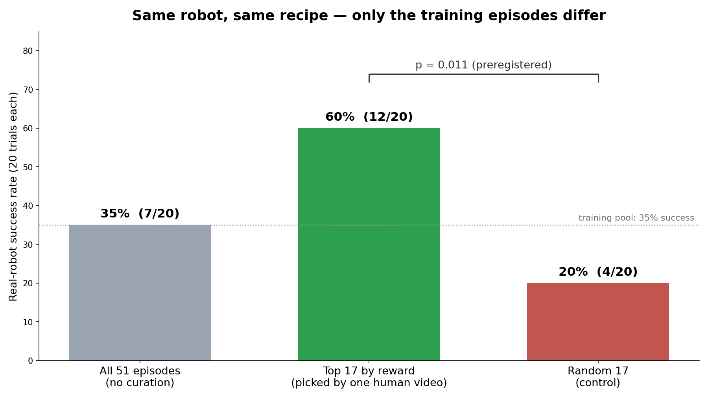
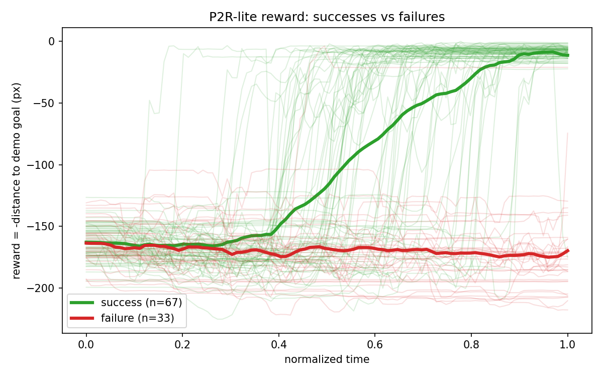
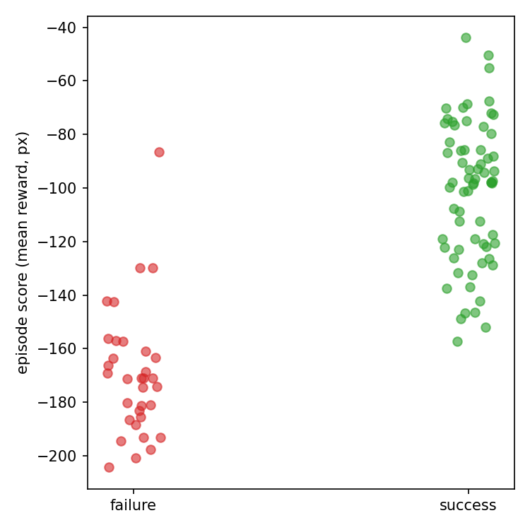

# P2R-Lite: One Human Video Is Enough to Teach a Robot to Judge Itself

A replication of **[Points2Reward](https://www.engineering.upenn.edu/~dineshj/publication/shipoints-2-reward/shipoints-2-reward.pdf)** (Shi, Smith, Qian, Jayaraman — Penn GRASP) on a ~$250 SO-101 robot arm, built solo.

*A single human demonstration, with 15 tracked points. Where those points end up in the final frame sets the goal the only supervision the robot every needs.*

## Results in one image

Three policies, identical training recipe, differing **only** in which episodes they learned from:

- Trained on **all** of the robot's own mixed-quality attempts → **35%** success (exactly its training data's success rate)
- Trained on the **17 episodes the reward ranked highest (top 1/3)** → **60%** success — nearly double, with **zero human labels**
- Trained on 17 **random** episodes (control) → **20%** — proving the selection did the work, not the smaller dataset

Preregistered before training ([M3_Prereg.md](M3_Prereg.md)); top-k vs random: p = 0.011, Fisher's exact.

## The premise

Robots learn well from demonstrations, but demonstrations are expensive. Someone has to operate the robot. A robot's *own* attempts are free, but most of them are bad, and training on bad attempts teaches bad habits. The missing piece is a cheap way to tell good attempts from bad ones **without a human watching**.

Points2Reward's answer: film a person doing the task **once**. Track a handful of points on the object through that video. Where the points end up in the last frame defines "success." Then, for every robot attempt, track the same kind of points and measure how close they get to that goal. That distance, one number per frame, is the reward.

*Two robot attempts scored by the reward in real time. The number needs no explanation — that's the point.*

## How it works

1. **One demo video.** I do the task once on camera (pick the red block, place it in the taped zone). I click 15 points on the block in frame one.
2. **Point tracking.** [CoTracker3](https://co-tracker.github.io/) follows those points through the demo. The final frame's point positions = the goal.
3. **Scoring robot attempts.** Each robot rollout gets points auto-seeded on the block (color detection) and tracked. Reward at time *t* = −(distance from the points' centroid to the goal), per the paper's Eq. 1.
4. **Validation.** On 100 labeled robot rollouts, ranking by final reward separates success from failure at **AP 0.997** (a naive pixel-difference baseline: 0.953; chance: 0.670).
5. **Filtered behavior cloning.** Rank a 51-episode mixed-quality pool by reward, keep the top third, train on it — the result in the chart above.

## Detailed results

**The reward separates successes from failures** (paper Fig. 3 analog — 100 rollouts, 5 policy checkpoints of varying skill):

**Reward as a success classifier** (average precision, 100 labeled rollouts):

| Method | AP |
|---|---|
| P2R-lite final reward | **0.997** |
| P2R-lite mean reward | 0.975 |
| Final-frame pixel difference (naive baseline) | 0.953 |
| Chance (base rate) | 0.670 |

**Filtered BC** (60 fresh real-robot trials, interleaved A→B→C blocks, freehand start positions, preregistered):

| Training set | Success | Mean final reward |
|---|---|---|
| All 51 pool episodes | 7/20 (35%) | −120 px |
| **Top 17 by reward** | **12/20 (60%)** | **−76 px** |
| Random 17 (control) | 4/20 (20%) | −124 px |

On these 60 held-out episodes the reward ranked every success above every failure — **AP 1.000**.

## What's in this repo

| File | What it does |
|---|---|
| `src/click_points.py` | Click points/landmarks on a video's first frame → JSON |
| `p2r_cotracker.ipynb` | Colab notebook: CoTracker3 on the demo + batch-tracking all rollouts |
| `src/reward.py` | The reward (Eq. 1, centroid variant) + validation plots |
| `src/ap_baseline.py` | AP computation + naive pixel-diff baseline |
| `src/make_m3_arms.py` | Seeded, preregistered selection of the three training arms |
| `M3_Prereg.md` | Hypotheses, metric, and episode lists — committed before training |

## Hardware & stack

SO-101 follower arm (Feetech STS3215 servos) · Logitech Brio overhead camera · [LeRobot](https://github.com/huggingface/lerobot) 0.5.1 for teleop/recording/ACT training · CoTracker3 for point tracking · training on Colab (L4). Task: pick a textured red block from a randomized start (~10 cm region) and place it in a taped goal zone.

## Deviations from the paper

- **CoTracker3** instead of CoTracker2 (same method, newer weights).
- **Manually clicked points** on the demo + color-detected seeds on rollouts, instead of the paper's 20×20 grid + automatic filtering + DINOv2 semantic correspondence.
- **Centroid distance** instead of per-point correspondence distance (my demo and rollout points aren't matched pairs; the centroid loses object orientation, which this task doesn't grade).
- **2D image-space reward** (single camera; the paper shows 3D helps but 2D works).

## Honest limitations

- When the gripper occludes the block, the tracked centroid wobbles (visible as noise in mid-episode reward). Final-frame reward is robust to it.
- One episode ended with the block touching the zone's edge: labeled a failure by my written rule, scored "almost" (−21 px) by the reward. Continuous rewards and binary labels genuinely disagree at boundaries — for filtering, arguably the reward is right.
- Top-k > all-episodes showed a large trend (60% vs 35%) but at N=20/arm reached only p = 0.10; the preregistered top-k > random comparison is the statistically confirmed result.
- One task, one scene, one camera. Missing generalization via DINOv2 machinery as seen in the paper

## Next

The loop this enables: the current best policy records fresh attempts → the reward curates them → retrain → repeat. Iteration 2 is in progress.

## Data & models

- Teleop dataset: [`lucbeck/p2r_pickplace_v1`](https://huggingface.co/datasets/lucbeck/p2r_pickplace_v1)
- ACT checkpoints (5 skill tiers): [`lucbeck/act_p2r_so101_checkpoints`](https://huggingface.co/lucbeck/act_p2r_so101_checkpoints)
- M3 training pool (100 merged rollout episodes): [`lucbeck/p2r_m3_pool`](https://huggingface.co/datasets/lucbeck/p2r_m3_pool)

---

*Independent replication by Luc Beck (Penn EE + AI). All credit for the method to the Points2Reward authors — this project exists because their paper made me want to see it work on my own desk.*
